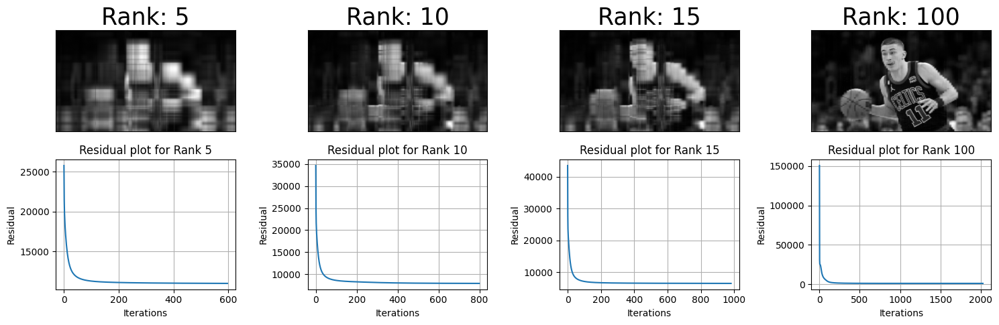
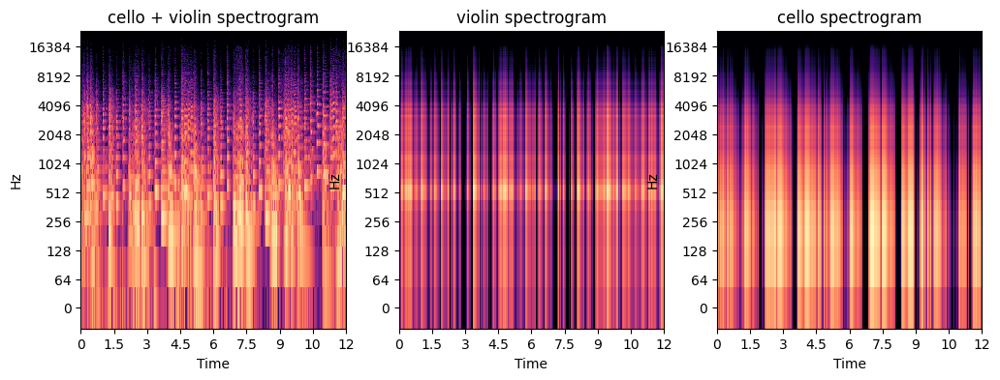

## ENEE469O - Introduction to Optimization Final Project Code
Authors: _Jason L._, _Denis F._

Code for Convex Non-Negative Matrix Factorization based on [Ding-Li-Jordan Paper](https://people.eecs.berkeley.edu/~jordan/papers/ding-li-jordan-pami.pdf) with applications to image compression and single channel audio source separation.

Given a non-negative matrix $$X$$, non-negative matrix factorization (NMF) attempts to factor $$X$$ into two non-negative matricies through minimizing the following standard objective:

$$\lVert X - WH \rVert _F^{2} \quad \text{Subject to} \quad  W\geq 0,H\geq 0$$

The objective of Convex NMF is formalized similarly:

$$\lVert X - XWG^T \rVert _F^{2} \quad \text{Subject to} \quad  W\geq 0, G^T\geq 0$$

Where $$\lVert . \rVert _F$$ denotes the Frobenius norm, $$F=XW$$, and the columns of $$F$$ are $$f_i = x_1w_1 + ... + x_nw_n$$, where $$w_i > 0$$

-----

NMF has applications in genomics, natural language processing, and machine learning. Below is an example of NMF being used for image compression, which allows for more efficient storage of files without noticeably degrading visual quality.

<p align="center">
  
</p>

Audio source separation is another application of NMF. The mixture audio source $$y(t)$$ is typically defined as a combination of individual sources $$x_i(t)$$. In practice, NMF is used on the time-frequency representation of the mixture via the STFT.

$$ y(t) = \sum_{i=1}^{N} x_i(t) \Rightarrow STFT(y(t)) = \sum_{i=1}^{N} STFT(x_i(t))$$

<p align="center">
  
</p>

-----

Python version: ```Python 3.10.5```

- Do ```git clone https://github.com/luoj21/enee469o_final_proj.git```
- Create a virtual environment: ```python -m venv .venv```
- Then do ```source .venv/bin/activate```
- Then ```pip install -r requirements.txt```
- The necessary notebooks used to simulate the convex/standard NMF comparisons are in the ```analysis``` folder

-----

References:
- [Audio Source Separation with NMF](https://medium.com/@zahrahafida.benslimane/audio-source-separation-using-non-negative-matrix-factorization-nmf-a8b204490c7d)
- [Audio Source Separation with NMF in PyTorch](https://gormatevosyan.com/audio-source-spearation-with-non-negative-matrix-factorization/)
- [Image Compression With NMF](https://github.com/akcarsten/Non_Negative_Matrix_Factorization)
- [General paper on NMF](https://papers.nips.cc/paper\_files/paper/2000/hash/f9d1152547c0bde01830b7e8bd60024c-Abstract.html)
- [Convex analysis of NMF](https://linjianma.github.io/pdf/NMF_227B_final_report.pdf)
- [KL-Divergence for NMF](https://www.researchgate.net/publication/221080181_Kullback-Leibler_Divergence_for_Nonnegative_Matrix_Factorization?__cf_chl_tk=Q5fyUsEhA6sEHEs.0h_IhFaW7sX76qzZNZ.dFxpvhU0-1774103022-1.0.1.1-Tto_B60EXOIFzLyl1avKouEynrJWu0JdiWxzm0Sjt0Y)
-----